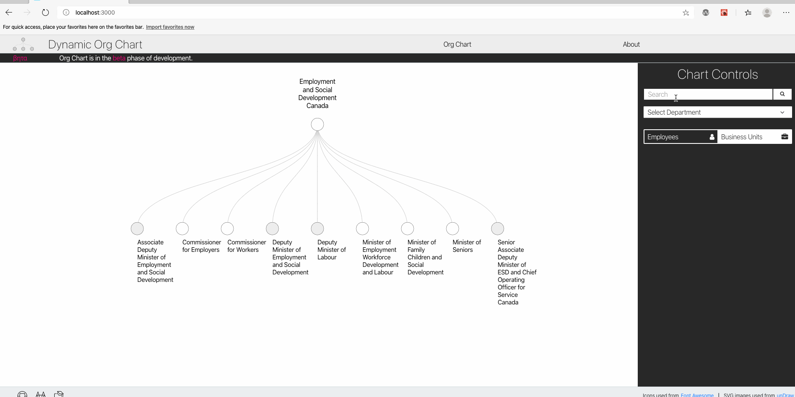
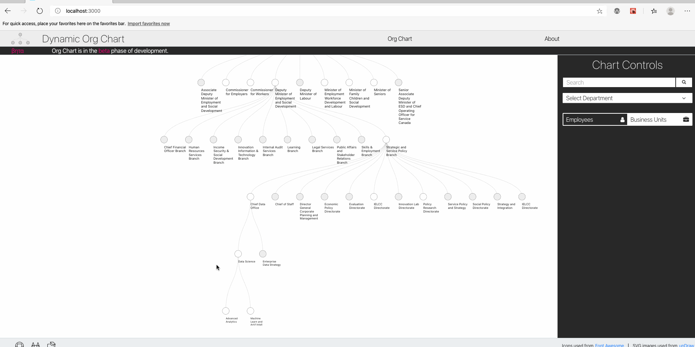
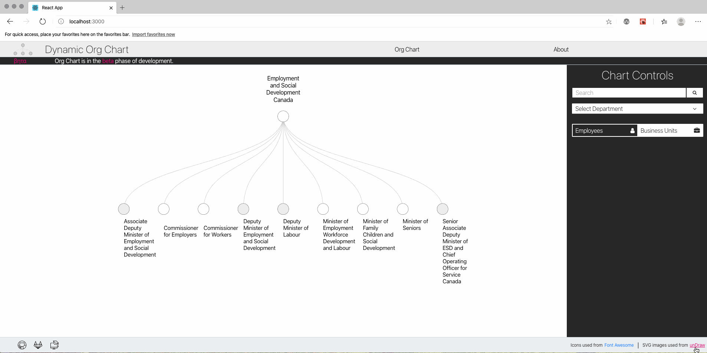
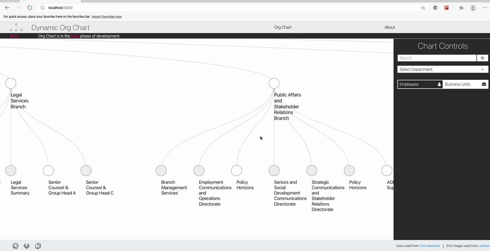

See [parent repository](https://github.com/DSD-ESDC-EDSC/dynamic-org-chart) for more information on the dynamic-org-chart project

# dynamic-org-chart-ui

> This repository illustrates one way to integrate D3.js with React. The use case for this integration is an interactive searchable organization chart for the Government of Canada. The underlying organization chart data are derived using the [Government of Canada Employee Contact Information (GEDS)](https://open.canada.ca/data/en/dataset/8ec4a9df-b76b-4a67-8f93-cdbc2e040098) dataset that is made available under the [Open Government License - Canada](https://open.canada.ca/en/open-government-licence-canada). The code that was used to extract the org chart from the GEDS dataset can be found [here](https://github.com/DSD-ESDC-EDSC/dynamic-org-chart-scripts).

## Start up instructions
1. In a terminal, clone ```dynamic-org-chart-ui``` into a folder on your computer.
```
git clone https://github.com/DSD-ESDC-EDSC/dynamic-org-chart-ui
```
2. Install all npm packages in the ```package.json``` file and start the react dev server. I.e. run
```
npm install
```
in the project root, then run
```
npm start
```
also in the project root.

## Overview and Features
D3.js is one of the most commonly used JavaScript libraries for building interactive data visualizations on the web. Similarly, React and the ecosystem of libraries built around React have become one of the most popular choices for building component based user interfaces. A common use case for integrating the two is to utilize React for its 

The use case of an interactive organization chart was chosen because it includes features that require interactions with React components to cause updates to the D3 visualization. Similarly, it requires that DOM elements controlled by D3 pass data to React so that React can update the application state and render/update components in response to the D3 interaction.

The features are listed below.

__Core features__
1. When a user clicks a node in the tree chart, D3 should handle how DOM elements are transitioned/animated, and then allow React to update this data in its state.


2. When a user selects a dataset from the dropdown menu, React should fetch the data for this tree, and pass it to d3 to render on the DOM.


1. When a user clicks on a search result, the tree chart should open to the node that contains what the user searched for (e.g. a business unit or person).



4. When a user clicks the "See the team" tooltip, the chart controls component should display the members who are on that team.



__Nice (but not essential) features__
1. When a user resizes their browser, the d3 visualization should resize to fit the user's screen.



2. The usual pan-and-zoom functionality that can be implemented with D3 should not be affected by this integration with React.



Note that several of these features above use fake data (e.g. fake search results, fake team list, etc). Since the focus of this repo is on integrating react and d3, using placeholder data is sufficient for illustrative purposes.

## High Level Overview
The approach used in this project is to allocate a react component that renders an empty SVG that D3 will treat as the root element. Inside this SVG, D3 has full DOM control, and application-level data are passed from React to D3 through props to the component that renders the SVG.

## React

### React hooks
This project makes use of [React hooks](https://reactjs.org/docs/hooks-intro.html) to allow functional components to make use of React state and lifecycle features without requiring class components.

### React refs
The TreeChartD3 component makes use of [React refs](https://reactjs.org/docs/refs-and-the-dom.html) to hold direct references to the empty SVG as well as the div element that contains it. Using these refs, it is possible to execute d3 code imperatively inside of the TreeChartD3 component. This allows the d3 code to directly modify DOM elements inside of the svg ref outside of React's typical data flow.

Intuitively, this means that the svg ref is the "hand-off" point where React lets d3 take control of the DOM. Unlike ordinary React components that are updating the virtual DOM and allowing React to reconcile differences between the virtual DOM and the "real" DOM, changes to the children of the svg ref will update the "real" DOM directly.

### React effects
React [effect hooks](https://reactjs.org/docs/hooks-effect.html) allow the user to implement "side effects" the same way they would if using ```componentDidMount``` or ```componentDidUpdate``` with classes in the React lifecycle. The ```useEffect``` hook takes a callback function (the "effect") as an argument. Since the ```useEffect``` hook is placed inside of a functional component, it automatically has access to any state variables or props of that component because the callback passed to ```useEffect``` is already inside the functional component's scope.

By default, ```useEffect``` hook will run the callback function it is passed after every render, however, it is possible to pass ```useEffect`` a [dependency array](https://reactjs.org/docs/hooks-effect.html#tip-optimizing-performance-by-skipping-effects) as a second argument. This dependency array specifies that instead of running the effect hook after every render, React should only run the callback of the effect hook when it detects a change in the variables passed to the dependency array.

This project makes use of a further customization to ```useEffect``` described in [this answer](https://stackoverflow.com/a/57941438) to a Stack Overflow post. The customization is a simple wrapper around ```useEffect``` called ```useDidMountEffect```. This wrapper behaves similarly to ```useEffect```, except the callback is not called on the initial render. ```useDidMountEffect``` basically mimics the functionality of ```componentDidUpdate``` in class based components.

This [blog post](https://overreacted.io/a-complete-guide-to-useeffect/) goes into more detail on ```useEffect```.

### Resize Observer
This project makes use of [resize-observer-polyfill](https://www.npmjs.com/package/resize-observer-polyfill) (the polyfill is chosen to make this functionality compatible with older browsers). The resize observer is wrapped in a function called ```useResizeObserver``` that takes a React ref as an argument and returns the dimensions (width and height) of the DOM element that is referenced.

The dimensions returned by ```useResizeObserver``` are one of the arguments to the dependency array in ```useDidMountEffect```, which means the effect callback will run any time there is a change to the dimensions of the ref that wraps the svg element. For example, whenever there is a browser window resize, the width and height of the svg wrapper will change, triggering the effect hook to run again. Inside of the effect callback, the width and height returned by ```useResizeObserver``` are used by d3 to generate the tree layout. This is how dynamic resizing of the d3 visualization is handled in this project.

## State Management
This project makes use of the [useContext hook](https://reactjs.org/docs/hooks-reference.html#usecontext) and the [Context API](https://reactjs.org/docs/context.html) provided by React. The section below briefly covers the approach used in this project. For a more in-depth explanation of this approach, see [this blog post](https://blog.logrocket.com/use-hooks-and-context-not-react-and-redux/) or [this YouTube tutorial series](https://www.youtube.com/watch?v=6RhOzQciVwI&list=PL4cUxeGkcC9hNokByJilPg5g9m2APUePI&index=1).

### React Context API
The Context API provides a way for React components to access global state variables without explicitly passing them multiple levels down the component tree (a practice sometimes called "prop drilling"). Prop drilling can be cumbersome and create overhead where components are passed props for the sole purpose of relaying them to downstream child components.

As an alternative, the Context API allows users to create a context object, from which a provider component can be created. The context provider allows data to be passed from the provider to any child components of that provider, no matter how deep in the component tree they are. In this project, the context provider looks as follows:

```JavaScript
const D3ContextProvider = (props) => {
    const [d3State, dispatch] = useReducer(d3Reducer, initialState);
    // Note: in React, child elements are passed to a component as properties.
    return (
        <D3Context.Provider value={{d3State, dispatch}}>
            {props.children}
        </D3Context.Provider>
    )
}
```

In this case, any child components that are wrapped by the ```D3ContextProvider``` component will have access to the ```d3State``` object and ```dispatch``` function (more information below on ```useReducer```). Since we want to treat ```d3State``` as a global, application level state, we wrap the entire application in the ```D3ContextProvider```. Therefore, inside of ```index.js``` we have:

```JavaScript
ReactDOM.render(
  <React.StrictMode>
    <D3ContextProvider>
      <App />
    </D3ContextProvider>
  </React.StrictMode>,
  document.getElementById('root')
);
```

### useContext hook
Prior to the introduction of React hooks, a single context could be set as a static property of the component class, and used inside of the ```render``` component method by destructuring the context variables required. To use multiple contexts, components that needed access to the contexts could be wrapped in nested ```<Context.Consumer>``` tags.

Once React hooks were introduced, it became possible to access multiple contexts by extracting any values passed from the context provider using the ```useContext``` hook. For example, in the ```TreeChartD3``` component, the state and dispatcher are extracted with a single line of code:
```JavaScript
function TreeChartD3() {
    // ...
    const { d3State, dispatch } = useContext(D3Context);
    // ...
}
```
This project makes use of the ```useContext``` hook to access the global level state provided by ```D3ContextProvider```.

### useReducer hook
As an alternative to the ```useState``` hook where each state variable is paired with its own setter function, the [useReducer](https://reactjs.org/docs/hooks-reference.html#usereducer) hook implements a pure function (reducer) that maps a state-action pair to a new state. ```useReducer``` works by accepting a reducer as well as an initial state, and returning a state object and a dispatcher function. The reducer is defined in ```d3Reducer.js``` and consists of a switch statement where each case corresponds to a different action. When an action is dispatched, the case in the switch statement is identified by a ```type``` field. Since ```d3State``` cannot be mutated, every case in ```d3Reducer``` returns a new object that contains the previous state along with any updates to state variables specified in the action associated with that case.

### Combining Context API with useReducer to manage global state
Since ```<App />``` is a child of ```<D3ContextProvider>```, every component under ```<App />``` gets access to ```d3State``` and ```dispatch```. Calls to ```dispatch``` specify a ```type``` field as well as any other fields required to perform an update to the global state. In this way, we need to only pass two props down from our context provider (```d3State``` and ```dispatch```), and any state variable can be accessed and updated using, respectively, ```d3State``` and ```dispatch```. This is in contrast to passing down multiple props from the context provider to enable updating to specific state variables.

## D3
The section below breifly covers key d3 concepts that relate to the integration between d3 and React.

### General Update Pattern
The general update pattern of d3 is to select elements, map and synchronize those elements to data, and define handlers for what should happen to the svgs when data are entered, updated, or exited. This [blog post](https://www.d3indepth.com/enterexit/) covers this update pattern in more detail.

### D3 Tree Chart
The original inspiration for the tree chart used in this project is from this [block](https://bl.ocks.org/d3noob/8375092) on [bl.ocks.org](https://bl.ocks.org/).

The data used in this project are formatted in the following way:
```
data = {
    "name": "Level 1",
    "children": [
        {
            "name": "Level 2 A",
            "children": [
                ...
            ]
        },
        {
            "name": "Level 2 B",
            "_children": [
                ...
            ]
        },
        ...
    ]
}
```
Children can be named ```children``` or ```_children```. The former indicates that the children should be indexed by d3's ```hierarchy``` function, while the latter indicates taht the children should not be indexed. Tree node event handlers make use of ```collapse``` and ```expand``` functions defined in ```utils/treeChartD3Utilities.js``` to toggle between these two properties by respectively hiding and showing children.

Given hierarchical data formatted as shown above, calling ```hierarchy(data)``` returns a tree-like data structure with many properties of the tree (e.g. height, depth, links between nodes, etc.) as well as various methods.

The ```descendents``` method returns a flat array containing all nodes of the tree, including the root. This is what d3 uses to draw the nodes of the tree.

The ```links``` method creates an array of all the links (edges) between nodes in the tree.

- ```const treeLayout = tree().size([height, width]); treeLayout(root)``` Given a height and width (see notes on resize observer above), enriches the nodes of roots with x and y coordinates that are calculated based on the width and height of ```treeLayout```.

- When nodes enter, they are given the class ```node```.

- ```d``` attribute for links is handled by the ```linkGenerator``` to draw the links between nodes
  

## Update Pattern - Important Notes
- D3 works by aligning data elements to DOM elements; this is done by performing a selection over DOM elements and calling ```.data(data, identityMappingCallback)``` on that selection to map each data point to a DOM element. The second argument is a callback function that provides an identity that maps each DOM element to its corresponding data point.
- By default, the identity mapping is just the index of the data structure (e.g. a JavaScript array would just use indices 0,1,2, etc. to correspond to the first, second, third, etc. DOM elements). If the data change, however (e.g. in an interactive visualization), this mapping would no longer be correct as elements entering/exiting the selection will not be assigned to their original identity.
- This is further complicated by the fact that we are "linking" d3 into the application by using a ```useRef()``` hook to provide a reference to the ```<svg>``` tag that d3 selects to append/remove elements from the DOM, and also a ```useEffect()``` hook to update the d3 component of the application whenever a change is detected from an outside react component that should affect the d3 visualization. For example, if the browser window resizes or some data is passed in from a parent/global state, then the code used to apply those modifications is implemented inside the ```useEffect()``` hook. ```useEffect()``` runs whenever it detects a change in one of the state variables inside the hook's dependancy array.
-  Below is the implementation of ```identityMappingCallback``` used in this project:
```JavaScript
identityMappingCallback = (d) => {
    if (d.id) {
        return d.id;
        } else {
        setIdentity(identity+1)
        return (d.id = ++identity)
        }
    }
```
- It is assumed there exists some int variable called ```identity``` that exists in a higher scope. One way to implement this correctly is to set this global variable as a state in a parent component, and pass the relevant setState function to the Tree Chart component. This way, when ```useEffect()``` fires again, it will not reset any variables declared in the scope of the ```TreeChart``` functional component.
  - If ```identity``` is set inside the scope of ```TreeChart```, any calls to ```useEffect()``` will reset the identity, which renders the mapping between data and DOM elements prior to the call to ```useEffect()``` incorrect.


### Other helpful resources
- This [YouTube playlist](https://www.youtube.com/watch?v=Y-ThTzB-Zjk&list=PLDZ4p-ENjbiPo4WH7KdHjh_EMI7Ic8b2B&index=20) covers an approach to integrating D3 and React that is similar to what is used in this project.
- This [blog post](https://bost.ocks.org/mike/selection/) by Mike Bostock (one of the main developers of d3) on how d3 selections work


__Sources__


5. https://www.tutorialspoint.com/d3js/d3js_svg_transformation.htm d3 tutorial on svg transformations
6.  https://stackoverflow.com/questions/53253940/make-react-useeffect-hook-not-run-on-initial-render/53254028#53254028 toggling useEffect hook on initial render vs. subsequent renders, https://stackoverflow.com/questions/53253940/make-react-useeffect-hook-not-run-on-initial-render also related
7.  https://www.d3indepth.com/enterexit/ enter update exit pattern in d3
8.  https://bost.ocks.org/mike/selection/ how selection works
9.  [D3 tree with weighted links and color coding](http://bl.ocks.org/shubhgo/80323b7f3881f874c02f)
10. [collapse function to hide children](https://stackoverflow.com/questions/45326393/how-to-show-only-specific-node-level-in-d3-tree-layout)
11. [centering with nodeSize vs. size](https://stackoverflow.com/questions/44013555/centering-of-d3-tree-changes-when-specifying-nodesize)
12. [.separation(callback(a,b)) to deal with spacing nodes that aren't immediate siblings](https://stackoverflow.com/questions/42524376/tree-nodesize-in-d3-v4)
13. [add tooltip](https://stackoverflow.com/questions/49611148/how-to-add-tooltip-in-react-d3-v4-bar-chart)
14. [react-d3 tooltip (TODO: see if there is a straightforward way to get the rendered tooltip by its ID then use d3 to handle transitions, delays, etc.)](https://github.com/react-d3/react-d3-tooltip) (see here also https://www.npmjs.com/package/react-d3-tooltip). Other approach could be to add/remove classes and handle transition animations with css (see [here](https://stackoverflow.com/questions/38116805/react-js-d3-charts-tooltip/56674517#56674517)).
15. [custom dropdown menu tutorial](https://blog.logrocket.com/building-a-custom-dropdown-menu-component-for-react-e94f02ced4a1/) with [github page](https://github.com/dbilgili/Custom-ReactJS-Dropdown-Components).
16. [D3-react tutorial](https://medium.com/@Elijah_Meeks/interactive-applications-with-react-d3-f76f7b3ebc71)

# License
Unless otherwise noted, program source code of this project is covered under Crown Copyright, Government of Canada, and is distributed under the [MIT License](https://github.com/DSD-ESDC-EDSC/dynamic-org-chart/blob/master/LICENSE.md).

The Canada wordmark and related graphics associated with this distribution are protected under trademark law and copyright law. No permission is granted to use them outside the parameters of the Government of Canada's corporate identity program. For more information, see [Federal identity requirements](https://www.canada.ca/en/treasury-board-secretariat/topics/government-communications/federal-identity-requirements.html).

# Attribution
This project would not be possible without the availability and use of open source software. Acknowledgement and attribution to the open source tools used, along with their corresponding open licenses (where one was found), can be found in the [ATTRIBUTION.md](https://github.com/DSD-ESDC-EDSC/dynamic-org-chart/blob/master/ATTRIBUTION.md) file in this repository. Users are advised to consult original sources for official information, especially if they plan on re-distributing all or parts of these code artifacts.

# How to Contribute
Instructions for how to contribute can be found in the CONTRIBUTING.md file.
